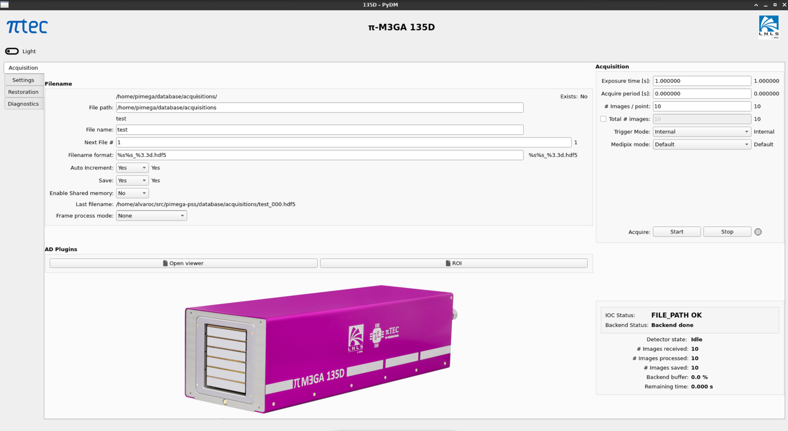
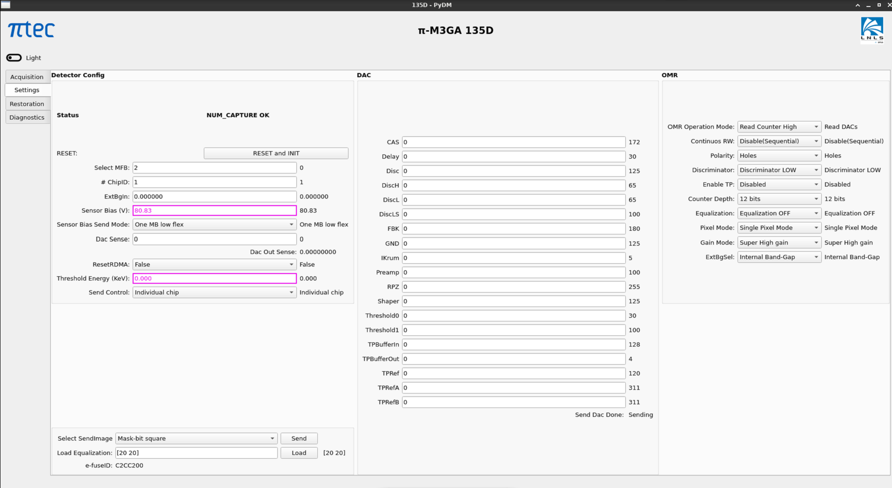
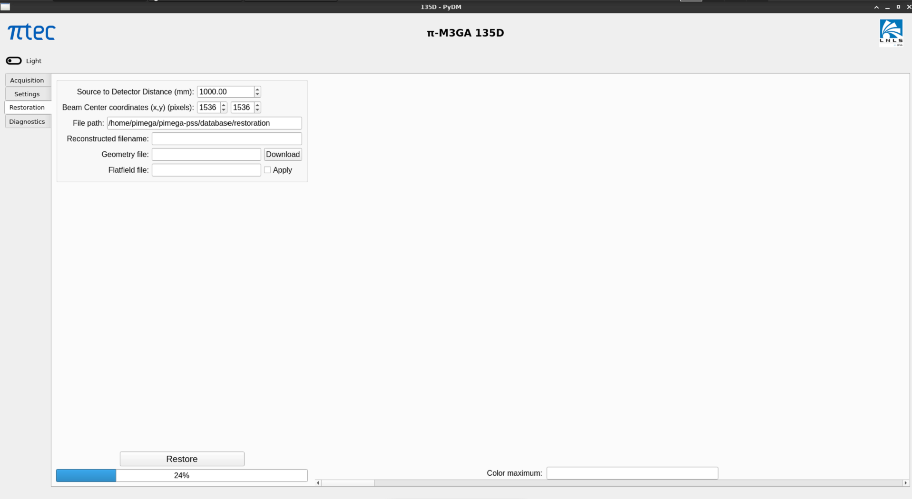
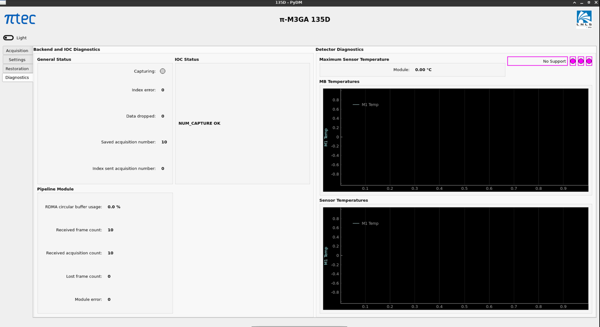

=============
ADPimega
=============

:author: Gabriel Amorim, Álvaro Costa

.. _ADDriver: https://areadetector.github.io/areaDetector/ADCore/ADDriver.html
.. _asynNDArrayDriver: https://areadetector.github.io/areaDetector/ADCore/NDArray.html#asynndarraydriver

.. contents:: Contents

Overview
--------

This is an :doc:`../index` driver for PIMEGA and RAD X-ray detectors from
`Pitec <https://pitec.co/>`_.

The interface to the detector is provided via a TCP/IP socket. The vendor
provides a library that is used by ADPimega to communicate with the detector.

To receive frames from the device it is necessary to use the vendor-provided
tool ``detector_backend``. It must be running before starting the IOC. It is a
server that receives frames from the detector via RoCE interface, reconstructs
the images and make them available through a ZeroMQ socket and/or save them to
disk as a HDF5 file. ADPimega uses the ZeroMQ socket to receive images and
convert them to NDArrays.

Both the library and the ``detector_backend`` tool are supported on Ubuntu 20.04
or later.

ADPimega inherits from `ADDriver`_. It implements some of the parameters in
`asynNDArrayDriver`_ and `ADDriver`_. It also implements parameters specific to
the PIMEGA and RAD detectors.

ADPimega specific parameters
----------------------------

Command Control
~~~~~~~~~~~~~~~

.. cssclass:: table-bordered table-striped table-hover
.. list-table::
    :header-rows: 1
    :widths: 20 20 20 40

    * - EPICS record name
      - Record type
      - drvInfo string
      - Description
    * - $(P)$(R)AllModules
        $(P)$(R)AllModules_RBV
      - mbbo, mbbi
      - ALL_MODULES
      - Whether to send commands to all modules or the current selected one.
    * - $(P)$(R)MB_SendMode
        $(P)$(R)MB_SendMode
      - mbbo, mbbi
      - MB_SEND_MODE
      - Select MB parameters send mode RBV
    * - $(P)$(R)MedipixBoard
        $(P)$(R)MedipixBoard_RBV
      - ao, ai
      - MEDIPIX_BOARD
      - Medipix Board Number
    * - $(P)$(R)ImgChipNumberID
        $(P)$(R)ImgChipNumberID_RBV
      - ao, ai
      - MEDIPIX_CHIP
      - Image Chip Number ID
    * - $(P)$(R)PimegaModule
        $(P)$(R)PimegaModule_RBV
      - mbbo, mbbi
      - PIMEGA_MODULE
      - Pimega module.
    * - $(P)$(R)OmrOMSelec
        $(P)$(R)OmrOMSelec_RBV
      - mbbo, mbbi
      - OMR_OP_MODE
      - OMR operation mode selection
    * - $(P)$(R)Reset
      - bo
      - RESET
      - Reset the detector.

System Status
~~~~~~~~~~~~~

.. cssclass:: table-bordered table-striped table-hover
.. list-table::
    :header-rows: 1
    :widths: 20 20 20 40

    * - EPICS record name
      - Record type
      - drvInfo string
      - Description
    * - $(P)$(R)Backend_BufferUsed_RBV
      - ai
      - BACK_BUFFER
      - Backend buffer usage.
    * - $(P)$(R)BackendStats_RBV
      - longin
      - BACKEND_STATS
      - Backend status update.
    * - $(P)$(R)CheckSensors
      - bo
      - CHECK_SENSORS
      - Check and disable defective sensors
    * - $(P)$(R)Diagnostic
      - bo
      - DIAGNOSTIC
      - Run diagnostic process in the detector.
    * - $(P)$(R)DiagnosticDir
      - waveform
      - DIAGNOSTIC_DIR
      - Directory in SD card to save diagnostic files.
    * - $(P)$(R)DiagnosticSysInfoID
      - waveform
      - DIAGNOSTIC_SYS_INFO_ID
      - User supplied file indentification string.
    * - $(P)$(R)DisabledSensorsM1_RBV
      - waveform
      - DISABLED_SENSORS_M1
      - Module 1 disabled sensors.
    * - $(P)$(R)DisabledSensorsM2_RBV
      - waveform
      - DISABLED_SENSORS_M2
      - Module 2 disabled sensors.
    * - $(P)$(R)DisabledSensorsM3_RBV
      - waveform
      - DISABLED_SENSORS_M3
      - Module 3 disabled sensors.
    * - $(P)$(R)DisabledSensorsM4_RBV
      - waveform
      - DISABLED_SENSORS_M4
      - Module 4 disabled sensors.
    * - $(P)$(R)eFuseID_RBV
      - waveform
      - EFUSE_ID
      - e-Fuse chip ID.
    * - $(P)$(R)IndexSentFramesCounter_RBV
      - longin
      - INDEX_COUNTER
      - Frames sent to index.
    * - $(P)$(R)IndexEnable
      - bo
      - INDEX_ENABLE
      - Enable index visualization.
    * - $(P)$(R)IndexSendMode
      - mbbo
      - INDEX_SEND_MODE
      - Index send mode.
    * - $(P)$(R)IOCStatusMessage_RBV
      - waveform
      - IOC_STATUS_MESSAGE
      - IOC status message.
    * - $(P)$(R)M1:RxAcquisitionCount_RBV
      - longin
      - M1_RECEIVED_ACQUISITION_COUNT
      - Module 1 received acquisition count.
    * - $(P)$(R)M1:LostFrameCount_RBV
      - longin
      - M1_LOST_FRAME_COUNT
      - Module 1 lost frame count.
    * - $(P)$(R)M1:RxError_RBV
      - longin
      - M1_RX_ERROR
      - Module 1 reception error
    * - $(P)$(R)M1:RxFrameCount_RBV
      - longin
      - M1_RECEIVED_FRAME_COUNT
      - Module 1 received frame count
    * - $(P)$(R)M2:RxAcquisitionCount_RBV
      - longin
      - M2_RECEIVED_ACQUISITION_COUNT
      - Module 2 received acquisition count
    * - $(P)$(R)M2:LostFrameCount_RBV
      - longin
      - M2_LOST_FRAME_COUNT
      - Module 2 lost frame count
    * - $(P)$(R)M2:RxError_RBV
      - longin
      - M2_RX_ERROR
      - Module 2 reception error.
    * - $(P)$(R)M2:RxFrameCount_RBV
      - longin
      - M2_RECEIVED_FRAME_COUNT
      - Module 2 received frame count
    * - $(P)$(R)M3:RxAcquisitionCount_RBV
      - longin
      - M3_RECEIVED_ACQUISITION_COUNT
      - Module 3 received acquisition count.
    * - $(P)$(R)M3:LostFrameCount_RBV
      - longin
      - M3_LOST_FRAME_COUNT
      - Module 3 lost frame count
    * - $(P)$(R)M3:RxError_RBV
      - longin
      - M3_RX_ERROR
      - Module 3 reception error.
    * - $(P)$(R)M3:RxFrameCount_RBV
      - longin
      - M3_RECEIVED_FRAME_COUNT
      - Module 3 received frame count
    * - $(P)$(R)M4:RxAcquisitionCount_RBV
      - longin
      - M4_RECEIVED_ACQUISITION_COUNT
      - Module 4 received acquisition count.
    * - $(P)$(R)M4:LostFrameCount_RBV
      - longin
      - M4_LOST_FRAME_COUNT
      - Module 4 lost frame count
    * - $(P)$(R)M4:RxError_RBV
      - longin
      - M4_RX_ERROR
      - Module 4 reception error.
    * - $(P)$(R)M4:RxFrameCount_RBV
      - longin
      - M4_RECEIVED_FRAME_COUNT
      - Module 4 received frame count
    * - $(P)$(R)ProcessedAcquisitionCounter_RBV
      - longin
      - PROCESSED_COUNTER
      - Acquisitions processed ready to save
    * - $(P)$(R)RxError_RBV
      - longin
      - RX_ERROR
      - Reception error
    * - $(P)$(R)ServerStatusMessage_RBV
      - waveform
      - SERVER_STATUS_MESSAGE
      - Server Status Message

Medipix Config
~~~~~~~~~~~~~~

.. cssclass:: table-bordered table-striped table-hover
.. list-table::
    :header-rows: 1
    :widths: 20 20 20 40

    * - EPICS record name
      - Record type
      - drvInfo string
      - Description
    * - $(P)$(R)ConfigDiscL
        $(P)$(R)ConfigDiscL_RBV
      - ao, ai
      - CONFIG_DISCL
      - Read/Write DAC ConfigDiscL value
    * - $(P)$(R)DAC_Disc
        $(P)$(R)DAC_Disc_RBV
      - ao, ai
      - DISC
      - Read/Write Disc DAC (discriminator current).
    * - $(P)$(R)DAC_DiscH
        $(P)$(R)DAC_DiscH_RBV
      - ao, ai
      - DISC_H
      - Read/Write DiscH DAC (high discriminator current).
    * - $(P)$(R)DAC_DiscL
        $(P)$(R)DAC_DiscL_RBV
      - ao, ai
      - DISC_L
      - Read/Write DiscL DAC (low discriminator current).
    * - $(P)$(R)DAC_DiscLS
        $(P)$(R)DAC_DiscLS_RBV
      - ao, ai
      - DISC_LS
      - Read/Write DiscLS DAC.
    * - $(P)$(R)Discriminator
        $(P)$(R)Discriminator_RBV
      - bo, bi
      - DISCRIMINATOR
      - Read/Write energy discriminator output.
    * - $(P)$(R)GainMode
        $(P)$(R)GainMode_RBV
      - mbbo, mbbi
      - GAIN_MODE
      - Sensor gain mode.
    * - $(P)$(R)PixelMode
        $(P)$(R)PixelMode_RBV
      - bo, bi
      - PIXEL_MODE
      - Pixel Mode count photons per pixel
    * - $(P)$(R)Polarity
        $(P)$(R)Polarity_RBV
      - bo, bi
      - POLARITY
      - Select pixel polarity
    * - $(P)$(R)ReadCounter
        $(P)$(R)ReadCounter_RBV
      - mbbo, mbbi
      - READ_COUNTER
      - Selects the counter(s) to be read
    * - $(P)$(R)SensorBias
        $(P)$(R)SensorBias_RBV
      - ao, ai
      - SENSOR_BIAS
      - Sensor Bias Voltage Flex Low/High
    * - $(P)$(R)DAC_ThresholdEnergy0
        $(P)$(R)DAC_ThresholdEnergy0_RBV
      - ao, ai
      - THRESHOLD0
      - Threshold 0 for photon detection
    * - $(P)$(R)DAC_ThresholdEnergy1
        $(P)$(R)DAC_ThresholdEnergy1_RBV
      - ao, ai
      - THRESHOLD1
      - Threshold 1 for photon detection

Acquisition
~~~~~~~~~~~

.. cssclass:: table-bordered table-striped table-hover
.. list-table::
    :header-rows: 1
    :widths: 20 20 20 40

    * - EPICS record name
      - Record type
      - drvInfo string
      - Description
    * - $(P)$(P)ContinuousRW
        $(P)$(P)ContinuousRW_RBV
      - bo, bi
      - CONTINUOUSRW
      - Enable Continuous Read/Write
    * - $(P)$(R)CounterDepth
        $(P)$(R)CounterDepth_RBV
      - mbbo, mbbi
      - COUNTER_DEPTH
      - Number of bits per pixel. 0 -> 1-bit / 1 -> 12-bits / 2 -> 6-bits / 3 -> 24-bits
    * - $(P)$(R)Distance
        $(P)$(R)Distance_RBV
      - ao, ai
      - DISTANCE
      - Sample distance from detector.
    * - $(P)$(R)ThresholdEnergy
        $(P)$(R)ThresholdEnergy_RBV
      - ao, ai
      - THRESHOLD_ENERGY
      - Threshold energy.
    * - $(P)$(R)MedipixMode
        $(P)$(R)MedipixMode_RBV
      - mbbo, mbbi
      - MEDIPIX_MODE
      - Medipix Acquire Mode
    * - $(P)$(R)CaptureAcquire
      - dfanout
      - N/A
      - Capture and Acquire

Equalization
~~~~~~~~~~~~

.. cssclass:: table-bordered table-striped table-hover
.. list-table::
    :header-rows: 1
    :widths: 20 20 20 40

    * - EPICS record name
      - Record type
      - drvInfo string
      - Description
    * - $(P)$(R)Equalization
        $(P)$(R)Equalization_RBV
      - bo, bi
      - EQUALIZATION
      - Read/Write threshold equalization mode.
    * - $(P)$(R)LoadEqualizationStart
      - bo
      - LOAD_EQUALIZATION_START
      - Start equalization.
    * - $(P)$(R)LoadEqualization
      - waveform
      - LOAD_EQUALIZATION
      - Load Equalization

Backend Config
~~~~~~~~~~~~~~

.. cssclass:: table-bordered table-striped table-hover
.. list-table::
    :header-rows: 1
    :widths: 20 20 20 40

    * - EPICS record name
      - Record type
      - drvInfo string
      - Description
    * - $(P)$(R)FrameProcessMode
        $(P)$(R)FrameProcessMode_RBV
      - mbbo, mbbi
      - FRAME_PROCESS_MODE
      - Frame process mode.
    * - $(P)$(R)Metadata_Field
      - waveform
      - METADATA_FIELD
      - Metadata field to operate on.
    * - $(P)$(R)Metadata_OM
      - mbbo
      - METADATA_OM
      - Metadata operation mode selection.
    * - $(P)$(R)Metadata_Value
        $(P)$(R)Metadata_Value_RBV
      - waveform
        waveform
      - METADATA_VALUE
      - Value of the selected metadata field.

Logging
~~~~~~~

.. cssclass:: table-bordered table-striped table-hover
.. list-table::
    :header-rows: 1
    :widths: 20 20 20 40

    * - EPICS record name
      - Record type
      - drvInfo string
      - Description
    * - $(P)$(R)logFile
      - waveform
      - LOGFILE
      - File to write log messages to.
    * - $(P)$(R)TraceMaskDriverIO
      - bo
      - TRACE_MASK_DRIVERIO
      - DriverIO Trace Mask
    * - $(P)$(R)TraceMaskError
      - bo
      - TRACE_MASK_ERROR
      - Error Trace Mask
    * - $(P)$(R)TraceMaskFlow
      - bo
      - TRACE_MASK_FLOW
      - Flow Trace Mask
    * - $(P)$(R)TraceMaskWarning
      - bo
      - TRACE_MASK_WARNING
      - Warning Trace Mask

Temperature
~~~~~~~~~~~

.. cssclass:: table-bordered table-striped table-hover
.. list-table::
    :header-rows: 1
    :widths: 20 20 20 40

    * - EPICS record name
      - Record type
      - drvInfo string
      - Description
    * - $(P)$(R)M1:MB_AvgTemperature_RBV
      - ai
      - MB_AVG_TSENSOR_M1
      - Module 1 MFB Avg Temperature
    * - $(P)$(R)M2:MB_AvgTemperature_RBV
      - ai
      - MB_AVG_TSENSOR_M2
      - Module 2 MFB Avg Temperature
    * - $(P)$(R)M3:MB_AvgTemperature_RBV
      - ai
      - MB_AVG_TSENSOR_M3
      - Module 3 MFB Avg Temperature
    * - $(P)$(R)M4:MB_AvgTemperature_RBV
      - ai
      - MB_AVG_TSENSOR_M4
      - Module 4 MFB Avg Temperature
    * - $(P)$(R)M1:MB_Temperature_RBV
      - waveform
      - MB_TEMPERATURE_M1
      - All Temperatures on MFB sensors in Module 1
    * - $(P)$(R)M2:MB_Temperature_RBV
      - waveform
      - MB_TEMPERATURE_M2
      - All Temperatures on MFB sensors in Module 2
    * - $(P)$(R)M3:MB_Temperature_RBV
      - waveform
      - MB_TEMPERATURE_M3
      - All Temperatures on MFB sensors in Module 3
    * - $(P)$(R)M4:MB_Temperature_RBV
      - waveform
      - MB_TEMPERATURE_M4
      - All Temperatures on MFB sensors in Module 4
    * - $(P)$(R)M1:Medipix_AvgTemperature_RBV
      - ai
      - MP_AVG_TSENSOR_M1
      - Medipix Avg Temperature for Module 1
    * - $(P)$(R)M2:Medipix_AvgTemperature_RBV
      - ai
      - MP_AVG_TSENSOR_M2
      - Medipix Avg Temperature for Module 2
    * - $(P)$(R)M3:Medipix_AvgTemperature_RBV
      - ai
      - MP_AVG_TSENSOR_M3
      - Medipix Avg Temperature for Module 3
    * - $(P)$(R)M4:Medipix_AvgTemperature_RBV
      - ai
      - MP_AVG_TSENSOR_M4
      - Medipix Avg Temperature for Module 4
    * - $(P)$(R)ReadMBTemperature
      - bo
      - READ_MB_TEMPERATURE
      - Process read MB temperatures
    * - $(P)$(R)ReadSensorsTemperature
      - bo
      - READ_SENSOR_TEMPERATURE
      - Process Read Sensors Temperatures
    * - $(P)$(R)M1:Sensor_Temperature_RBV
      - waveform
      - SENSOR_TEMPERATURE_M1
      - All sensors temperatures  on Module 1
    * - $(P)$(R)M2:Sensor_Temperature_RBV
      - waveform
      - SENSOR_TEMPERATURE_M2
      - All sensors temperatures  on Module 2
    * - $(P)$(R)M3:Sensor_Temperature_RBV
      - waveform
      - SENSOR_TEMPERATURE_M3
      - All sensors temperatures  on Module 3
    * - $(P)$(R)M4:Sensor_Temperature_RBV
      - waveform
      - SENSOR_TEMPERATURE_M4
      - All sensors temperatures  on Module 4
    * - $(P)$(R)M1:Highest_Temperature
      - ai
      - TEMP_HIGHEST_M1
      - Medipix Board Highest Temperature Module 1
    * - $(P)$(R)M2:Highest_Temperature
      - ai
      - TEMP_HIGHEST_M2
      - Medipix Board Highest Temperature Module 2
    * - $(P)$(R)M3:Highest_Temperature
      - ai
      - TEMP_HIGHEST_M3
      - Medipix Board Highest Temperature Module 3
    * - $(P)$(R)M4:Highest_Temperature
      - ai
      - TEMP_HIGHEST_M4
      - Medipix Board Highest Temperature Module 4
    * - $(P)$(R)M1:Temperature_Status
      - mbbi
      - TEMP_STATUS_M1
      - Medipix Board Temperature Status Module 1
    * - $(P)$(R)M2:Temperature_Status
      - mbbi
      - TEMP_STATUS_M2
      - Medipix Board Temperature Status Module 2
    * - $(P)$(R)M3:Temperature_Status
      - mbbi
      - TEMP_STATUS_M3
      - Medipix Board Temperature Status Module 3
    * - $(P)$(R)M4:Temperature_Status
      - mbbi
      - TEMP_STATUS_M4
      - Medipix Board Temperature Status Module 4
    * - $(P)$(R)TemperatureMonitor_Enable
        $(P)$(R)TemperatureMonitor_Enable_RBV
      - bo, bi
      - TEMP_MONITOR_ENABLE
      - Enable Temperature Monitor

Test Pulse
~~~~~~~~~~

.. cssclass:: table-bordered table-striped table-hover
.. list-table::
    :header-rows: 1
    :widths: 20 20 20 40

    * - EPICS record name
      - Record type
      - drvInfo string
      - Description
    * - $(P)$(R)TestPulse
        $(P)$(R)TestPulse_RBV
      - bo, bi
      - TEST_PULSE
      - Enable test pulse
        Enable test pulse readback
    * - $(P)$(R)DAC_TPBufferIn
        $(P)$(R)DAC_TPBufferIn_RBV
      - ao, ai
      - TP_BUFFER_IN
      - Test pulse input buffer current
    * - $(P)$(R)DAC_TPBufferOut
        $(P)$(R)DAC_TPBufferOut_RBV
      - ao, ai
      - TP_BUFFER_OUT
      - Test pulse output buffer current
    * - $(P)$(R)DAC_TPRef
        $(P)$(R)DAC_TPRef_RBV
      - ao, ai
      - TP_REF
      - Test pulses 1 and 2 reference voltage
    * - $(P)$(R)DAC_TPRefA
        $(P)$(R)DAC_TPRefA_RBV
      - ao, ai
      - TP_REF_A
      - Test pulse 1 voltage
    * - $(P)$(R)DAC_TPRefB
        $(P)$(R)DAC_TPRefB_RBV
      - ao, ai
      - TP_REF_B
      - Test pulse 2 voltage

Configuration
-------------

The ADPimega driver instance is created using the ``pimegaDetectorConfig`` command, either from C/C++ or from the EPICS IOC shell.::

  int pimegaDetectorConfig(
    const char *portName, const char *address_module01,
    const char *address_module02, const char *address_module03,
    const char *address_module04, const char *address_module05,
    const char *address_module06, const char *address_module07,
    const char *address_module08, const char *address_module09,
    const char *address_module10, int port, int maxSizeX, int maxSizeY,
    int detectorModel, int maxBuffers, size_t maxMemory, int priority,
    int stackSize, int simulate, int backendOn, int log,
    unsigned short backend_port, unsigned short vis_frame_port,
    int IntAcqResetRDMA, int numModulesX, int numModulesY);

Screenshots
-----------

Restrictions
------------

* To perform an acquisition, first the ``$(P)$(R)Capture`` record should be set
  to 1 and then the ``$(P)$(R)Acquire`` record. For convenience, there is a
  record ``$(P)$(R)CaptureAcquire`` that sets both at once.

* Currently, the ZeroMQ stream does not stream at high frame rates. It is useful
  for a visualization tool, where not all frames are needed. Only the
  ``detector_backend`` can save images at high frame rates for now.